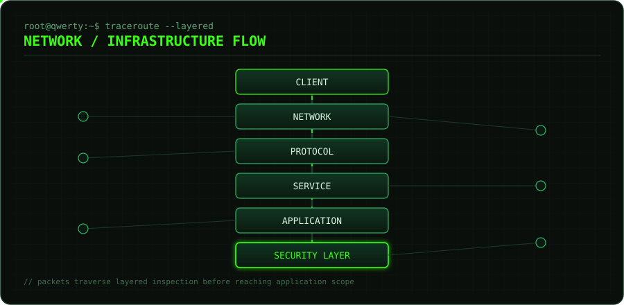
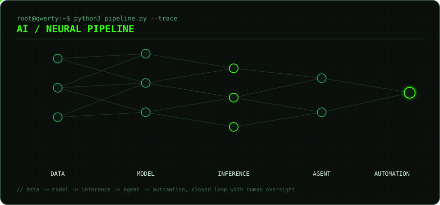

[README.md](https://github.com/user-attachments/files/31970382/README.md)
<div align="center">


<a href="#">
  
</a>

</div>

<br/>

<!-- ============================================================ -->
<!-- HERO / IDENTITY                                               -->
<!-- ============================================================ -->

<table align="center">
<tr><td>

```
> Security Researcher
> Network & Web Security
> AI Engineer
> Automation & Systems
```

</td></tr>
</table>

<p align="center">
I work across offensive/defensive security, network &amp; protocol analysis, web application security,<br/>
and applied AI — building tools that sit at the intersection of security research and autonomous systems.
</p>

<div align="center">


</div>

<br/>

<!-- ============================================================ -->
<!-- SKILL MATRIX                                                  -->
<!-- ============================================================ -->

<h3 align="center">📊 SKILL MATRIX</h3>

<div align="center">

</div>

<br/>

<!-- ============================================================ -->
<!-- SECURITY                                                      -->
<!-- ============================================================ -->

<h3 align="center">🛡️ SECURITY</h3>

<div align="center">

| DOMAIN | FOCUS |
|---|---|
| `WEB SECURITY` | Application-layer flaws, auth/session abuse, input-handling failures |
| `NETWORK SECURITY` | Segmentation, traffic inspection, hardening |
| `PROTOCOL ANALYSIS` | Packet-level inspection, custom parsers, protocol fuzzing |
| `VULNERABILITY RESEARCH` | Root-cause analysis, reproducible PoCs |
| `SECURITY AUTOMATION` | Scripted detection, response tooling, pipelines |
| `LINUX / SYSTEMS` | Hardened environments, scripting, process isolation |
| `REVERSE ENGINEERING` | Static/dynamic analysis of binaries and traffic |

</div>

```bash
qwerty@github:~$ systemctl status security-engine
● security-engine.service — active (running)
```

<br/>

<!-- ============================================================ -->
<!-- NETWORK                                                       -->
<!-- ============================================================ -->

<h3 align="center">🌐 NETWORK / INFRASTRUCTURE</h3>

<div align="center">

</div>

<br/>

<!-- ============================================================ -->
<!-- AI                                                            -->
<!-- ============================================================ -->

<h3 align="center">🧠 AI / NEURAL SYSTEMS</h3>

<div align="center">

</div>

<div align="center">

`MACHINE LEARNING` · `DEEP LEARNING` · `LLMs` · `AI AGENTS` · `AI AUTOMATION` · `AI SECURITY`

</div>

<br/>

<!-- ============================================================ -->
<!-- TECH STACK                                                    -->
<!-- ============================================================ -->

<h3 align="center">⚙️ TECH STACK</h3>

<div align="center">

**Languages**
<br/>


**Web**
<br/>


**Systems &amp; Tooling**
<br/>


**AI / ML**
<br/>


</div>

<br/>

<!-- ============================================================ -->
<!-- TERMINAL                                                      -->
<!-- ============================================================ -->

<h3 align="center">💻 TERMINAL</h3>

<div align="center">

</div>

```bash
qwerty@github:~$ whoami
QWERTY

qwerty@github:~$ systemctl status security
● security-engine.service
  Active: active (running)

qwerty@github:~$ systemctl status neural-engine
● neural-engine.service
  Active: active (running)

qwerty@github:~$ _
```

<br/>

<!-- ============================================================ -->
<!-- GITHUB STATISTICS                                             -->
<!-- ============================================================ -->

<h3 align="center">📈 GITHUB STATISTICS</h3>

<div align="center">


</div>

<br/>

<!-- ============================================================ -->
<!-- CONTRIBUTION SNAKE                                            -->
<!-- ============================================================ -->

<h3 align="center">🐍 CONTRIBUTION SNAKE</h3>

<div align="center">

<!--
  This image is generated by the GitHub Action in
  .github/workflows/snake.yml — see SETUP below.
  Replace qwerty0x404 with your actual GitHub username.
-->


</div>

<br/>

<!-- ============================================================ -->
<!-- PROJECTS (placeholder — uncomment when repos exist)           -->
<!-- ============================================================ -->

<h3 align="center">📁 FEATURED PROJECTS</h3>

<div align="center">

<!--
<a href="https://github.com/qwerty0x404/PROJECT_01">
  
</a>
<a href="https://github.com/qwerty0x404/PROJECT_02">
  
</a>
<a href="https://github.com/qwerty0x404/PROJECT_03">
  
</a>
-->

`PROJECT_01` · `PROJECT_02` · `PROJECT_03`
<br/>
<sub>reserved — populated as repositories are published</sub>

</div>

<br/>

<!-- ============================================================ -->
<!-- PHILOSOPHY                                                    -->
<!-- ============================================================ -->

<h3 align="center">◆ PHILOSOPHY</h3>

<blockquote align="center">
Understand the system.<br/>
Find the weakness.<br/>
Build something better.
</blockquote>

<br/>

<!-- ============================================================ -->
<!-- FOOTER                                                        -->
<!-- ============================================================ -->

<div align="center">

<!-- optional: add real links, or delete this row -->
<!--
<a href="https://twitter.com/qwerty0x404"></a>
<a href="mailto:you@example.com"></a>
-->


</div>
